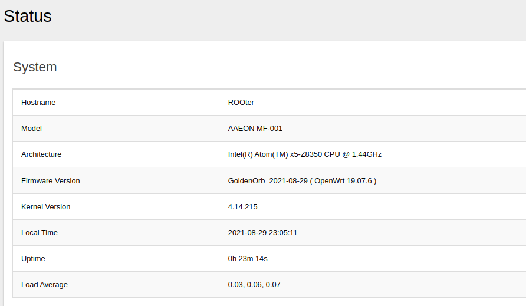
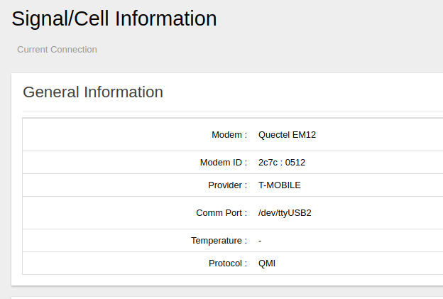

# Atomic-Pi-ROOTER

Atomic Pi ROOter AP builds. Openwrt built for cellular modems.                                                                                  

* [/atomicpi-generic/](atomicpi-generic/) - AtomicPi GoldenOrb_2021-08-29 (OpenWRT 19.07.6) firmware built with the default X86-64 option as described below. USB/SD.

Built with the standard rooter repo (https://github.com/ofmodemsandmen/RooterSource) and UEFI Support (https://github.com/falafalafala1668/OpenWrt-UEFI-Support)

Builds use this method:
* git clone https://github.com/ofmodemsandmen/RooterSource rooter19076
* cd rooter19076
* git clone https://github.com/falafalafala1668/OpenWrt-UEFI-Support.git -b openwrt-19.07
* ./OpenWrt-UEFI-Support/RunMe.sh apply
* ./build X86-64

